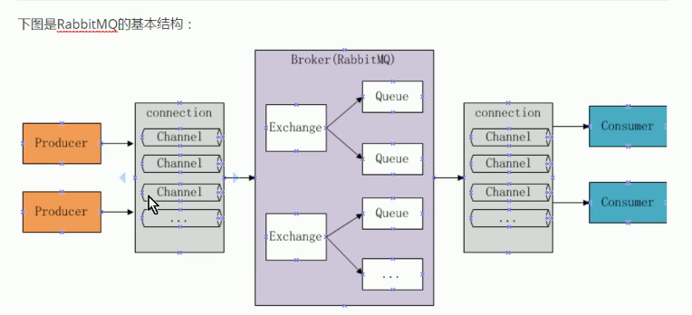
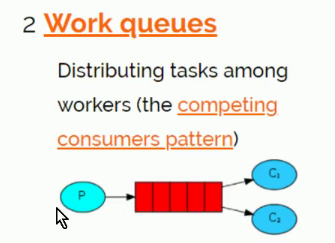
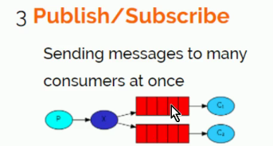
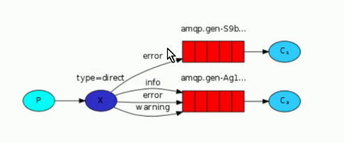
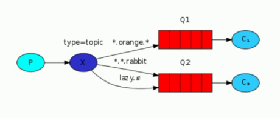
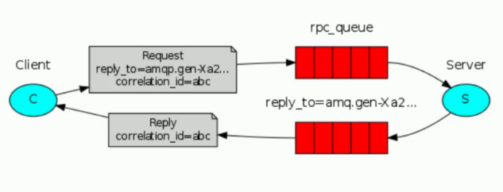
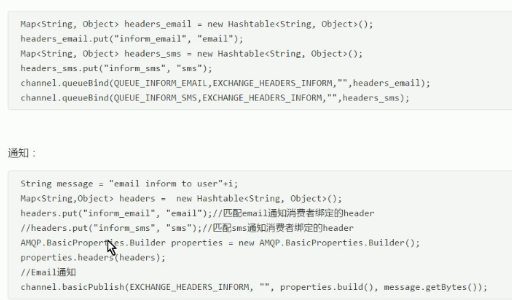

# springboot
各种框架的整合案例
#### rabbitMQ入门
1. 安装rabbitMQ
2. 导入jar包
```
<dependency>
	<groupId>com.rabbitmq</groupId>
	<artifactId>amqp-client</artifactId>
	<version>4.0.3</version>
</dependency>
<dependency>
	<groupId>org.springframework.boot</groupId>
	<artifactId>spring-boot-starter-logging</artifactId>
</dependency>
```
3. 工作原理

#### rabbitMQ基础案例
```
生产者:com.rabbitmq.base.Producer
消费者:com.rabbitmq.base.Consumer
```
#### 工作模式
1. Work Queues 工作队列



2. Publish/Subscribe 发布订阅



3. Routing 路由



4. Topics 通配符



5. Header Header转发器

6. RPC 远程调用



#### 工作队列模式(Work Queues)

测试程序：程序和入门程序一致，

1. 将消费者打开多个；
 
2. 使用生产者多次发送数据；

3. 消费者以默认轮询的方式接收数据；

#### 发布订阅模式(Publish/Subscribe)
```
生产者:com.rabbitmq.publishsubscribe.Producter
消费者:com.rabbitmq.publishsubscribe.ConsumerEmall
消费者:com.rabbitmq.publishsubscribe.ConsumerSms
```

- 发布订阅的每一个分支都相当于一个工作队列模式

#### 路由模式(Routing) 

1. 说明:

- 一个交换机绑定多个队列,每个队列设置routingkey,并且一个队列可以设置多个routingkey

- 每个消费者监听自己的队列

- 生产者将消息发给交换机,发送消息时需要制定routingkey的值,交换机来判断该routingkey的值和哪个队列的routingkey相等,如果相等则将消息发送到该队列

2. 测试实现:
```
生产者:com.rabbitmq.routing.Producter
消费者:com.rabbitmq.routing.ConsumerEmall
消费者:com.rabbitmq.routing.ConsumerSms
```
#### 通配符模式(Topics) 

1. 说明
	
	- 一个交换机可以绑定多个队列,每个队列可以额设置一个或多个带通配符的routingkey
	
	- 生产者将消息发送给交换机,交换机根据routingkey的值来匹配队列,匹配时采用通配符方式,匹配成功的将消息转发到指定队列
	
	- routing模式是匹配相等,topics模式是统配符匹配
	
		- 符号#:匹配一个或多个词,比如inform.#可以匹配inform.emall,inform.sms.emall
		
		- 符号*:只能匹配一个词,比如inform.* 可以匹配inform.emall,不能匹配inform.sms.emall
	
2. 测试
```
生产者:com.rabbitmq.topics.Producter
消费者:com.rabbitmq.topics.ConsumerEmall
消费者:com.rabbitmq.topics.ConsumerSms
```
#### Header模式

1. 说明:
	- header模式与routing不同的地方在于,header模式取消了routingkey,使用header中的key/value(键值对)匹配队列
	
	
	
	
	
	
	
	


