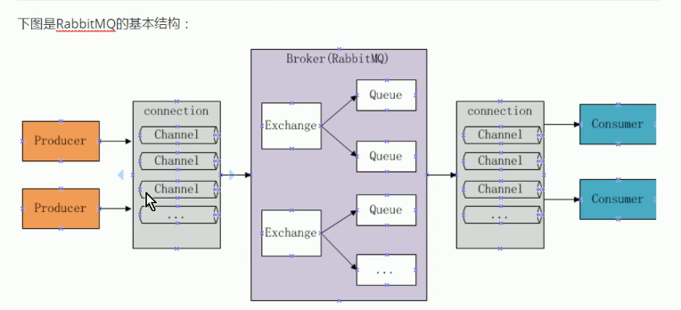

# springboot
各种框架的整合案例
#### rabbitMQ测试
1. 安装rabbitMQ
2. 导入jar包
```
<dependency>
	<groupId>com.rabbitmq</groupId>
	<artifactId>amqp-client</artifactId>
	<version>4.0.3</version>
</dependency>
<dependency>
	<groupId>org.springframework.boot</groupId>
	<artifactId>spring-boot-starter-logging</artifactId>
</dependency>
```
3. 工作原理

#### rabbitMQ基础案例
```
生产者:
消费者:
```
